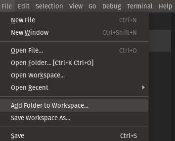
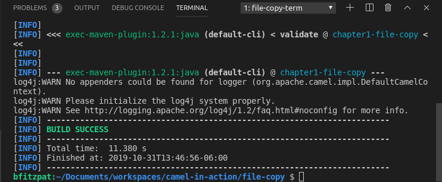

# Camel in Action 2, Chapter 1 - Meeting Camel

Chapter 1 introduces you to Camel and explains what Camel is and where it fits into the bigger enterprise software picture. You’ll also learn the concepts and terminology of Camel. 

(Check out [Camel in Action, Second Edition](https://www.manning.com/books/camel-in-action-second-edition)) to get a copy of the book!)

The chapter outline includes:

- An introduction to Camel
- Camel’s main features
- Your first Camel ride
- Camel’s architecture and concepts

Use the steps that follow to help you as you go through the chapter!

## Prerequisites

<a href='didact://?commandId=vscode.didact.validateAllRequirements' title='Validate all requirements!'><button>Validate all Requirements at Once!</button></a>

| Requirement (Click to Verify)  | Availability | Additional Information/Solution |
| :--- | :--- | :--- |
| [At least one folder exists in the workspace](didact://?commandId=vscode.didact.workspaceFolderExistsCheck&text=workspace-folder-status&completion=A%20valid%20folder%20exists%20in%20the%20workspace. "Ensure that at least one folder exists in the user workspace"){.didact} | *Status: unknown*{#workspace-folder-status} | Create a workspace folder (or [click here to create a temporary folder](didact://?commandId=vscode.didact.createWorkspaceFolder&completion=Created%20temporary%20folder%20in%20the%20workspace. "Create a temporary folder and add it to the workspace."){.didact}), close, and reopen the Didact window
| [Apache Maven is accessible at the command line](didact://?commandId=vscode.didact.requirementCheck&text=maven-requirements-status$$mvn%20--version$$Apache%20Maven&completion=Apache%20Maven%20is%20available%20on%20this%20system. "Tests to see if `mvn -version` returns a result"){.didact} 	| *Status: unknown*{#maven-requirements-status} 	| See [Installing Apache Maven](https://maven.apache.org/install.html "Documentation on how to Install Apache Maven on your system") and then restart VS Code
| [VS Code Extension Pack for Apache Camel by Red Hat is installed](didact://?commandId=vscode.didact.extensionRequirementCheck&text=extension-requirement-status$$redhat.apache-camel-extension-pack&completion=Camel%20extension%20pack%20available. "Checks the VS Code workspace to make sure the extension pack is installed"){.didact} | *Status: unknown*{#extension-requirement-status} 	| [Click here to install](vscode:extension/redhat.apache-camel-extension-pack "Opens the extension page and provides an install link") |

## Your First Camel Ride

Chapter 1 of *Camel in Action* walks through a simple example that moves files from one directory to another. This is a common integration case where you are reading files from one directory, processing them, and then writing the result to another directory.

### Step 1: Downloading the Project Source

{.imageRight}

First, we need to set up our sample project. You can find code for all the *Camel in Action* examples from the [GitHub project that's hosting the source.](https://github.com/camelinaction/camelinaction2)

For this first example, you can download the code yourself from the GitHub repo and then [add the `file-copy` folder to your workspace.](didact://?commandId=workbench.action.addRootFolder "Same action as going to the Command Palette (F1 or Ctrl+Shift+P) and typing 'Workspaces: Add Folder to Workspace...'"){.didact}

Or you can [create a sample project in your VS Code workspace.](didact://?commandId=vscode.didact.scaffoldProject&srcFilePath=demos/markdown/camelinaction/chapter1/file-copy/file-copy-project.json&completion=Created%20file-copy%20project. "Scaffolds a project based on the Chapter 1 project structure"){.didact}

### Step 2: Exploring the Pure Java Solution

The chapter starts by looking at the pure Java solution with no Camel. You can find that in the `file-copy` directory at `src/main/java/camleinaction/FileCopier.java`. If you have the project in your workspace, you can [open the java file in the editor.](didact://?commandId=vscode.open&projectFilePath=file-copy/src/main/java/camelinaction/FileCopier.java&completion=Opened%20the%20FileCopier.java%20file "Opens the FileCopier.java file"){.didact}

### Step 3: Exploring the Camel Solution

The chapter then looks at the Camel solution. You can find that in the `file-copy` directory at `src/main/java/camleinaction/FileCopierWithCamel.java`. If you have the project in your workspace, you can [open the Java Camel file in the editor.](didact://?commandId=vscode.open&projectFilePath=file-copy/src/main/java/camelinaction/FileCopierWithCamel.java&completion=Opened%20the%20FileCopierWithCamel.java%20file "Opens the FileCopierWithCamel.java file"){.didact}

### Step 4: Running the Route

To run the route, you may need to update your project to pull in all the appropriate artifacts from Maven. You can [update the `file-copy` folder in your workspace](didact://?commandId=java.projectConfiguration.update&projectFilePath=file-copy/pom.xml&completion=Updated%20the%20file-copy%20project "Refreshes the project's maven configuration using a command from vscode-java"){.didact}. (This is the same action as selecting the `file-copy` folder in the Explorer, then typing `Java: Update project configuration` in the Command Palette (F1 or Ctrl+Shift+P).)

Once your project is up-to-date, you can open a Terminal window to run it at a command prompt. You can use the Terminal menu (`Terminal->New Terminal`) or use [this link to open a new terminal called 'file-copy-term' and automatically change to the 'file-copy' folder.](didact://?commandId=vscode.didact.startTerminalWithName&text=file-copy-term&projectFilePath=file-copy&completion=Opened%20the%20file-copy-term%20terminal. "Opens a new terminal called 'file-copy-term'"){.didact}

To run our route, we must execute `mvn exec:java` at the command prompt in our project folder. Or you can use [this link to do that for you in the `file-copy-term` terminal we opened a moment ago.](didact://?commandId=vscode.didact.sendNamedTerminalAString&text=file-copy-term$$mvn%20exec:java&completion=Sent%20commands%20to%20terminal%20window. "Runs mvn exec:java in the file-copy folder"){.didact}

You can watch the log as messages appear in the terminal window while the Camel route starts up and copies the file from the `inbox` to the `outbox`.

{.imageCenter}

When it finishes, you can open the output file in the `file-copy/data/outbox` directory (or [use this link to open the file.](didact://?commandId=vscode.open&projectFilePath=file-copy/data/outbox/message1.xml&completion=Opened%20the%20output%20file "Opens the file copied to the output folder"){.didact})

<details><summary>Step 5: Bonus points!</summary>

To get a feel for modifying a Camel route yourself, why not add a log message?

[Open the FileCopierWithCamel.java file](didact://?commandId=vscode.open&projectFilePath=file-copy/src/main/java/camelinaction/FileCopierWithCamel.java&completion=Opened%20the%FileCopierWithCamel.java%20file "Opens the FileCopierWithCamel.java file in the created project"){.didact} and add the following in the `public void configure()` method between the from and the to:

```java
    .log("Hello World!")
```

Re-run the route in the terminal window and look for `Hello World!` to show up in the logged messages that appear.

If you get stuck, check the solution below:

<details><summary>Solution!</summary>

Your Camel route then should then look something like:

```java
        context.addRoutes(new RouteBuilder() {
            public void configure() {
                from("file:data/inbox?noop=true").log("Hello World!").to("file:data/outbox");
            }
        });
```

And you should find *Hello World!* in your console output when you re-run the route with `mvn exec:java` at the command line. Or you can use [this link to do that for you in the `file-copy-term` terminal we opened a few moments ago.](didact://?commandId=vscode.didact.sendNamedTerminalAString&text=file-copy-term$$mvn%20exec:java&completion=Sent%20commands%20to%20terminal%20window. "Runs mvn exec:java again in the workspace"){.didact}

{.imageCenter}

</details>

</details>

